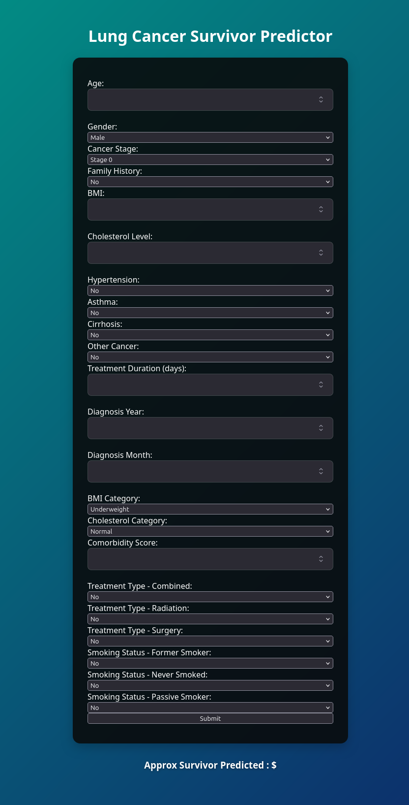

# Lung Cancer Detector

A machine learning project that analyzes patient data to assist in detecting or studying lung cancer diagnosis patterns based on demographic and medical features.

##  Dataset Features
- Patient ID, Age, Gender, Country
- Diagnosis Date, Cancer Stage
- Family History, Smoking Status
- BMI, Cholesterol Level
- Comorbidities: Hypertension, Asthma, Cirrhosis, Other Cancer
- Treatment Type, End Treatment Date

##  Features
- Exploratory Data Analysis (EDA)
- Visualization of health risk factors
- Preprocessing and feature encoding
- Classification model for cancer risk/stage prediction

##  Tech Stack
- Python
- pandas, numpy
- seaborn, matplotlib
- scikit-learn

##  ML Models
- Logistic Regression
- Decision Trees
- Random Forest 
- catboost
- gradient boosting

##  Installation
```bash
git clone https://github.com/AyushAI14/Lung-cancer-detector.git
cd Lung-cancer-detector
python3 -m venv env
source env/bin/activate
pip install -r requirements.txt
Run app.py 

## Web APP


